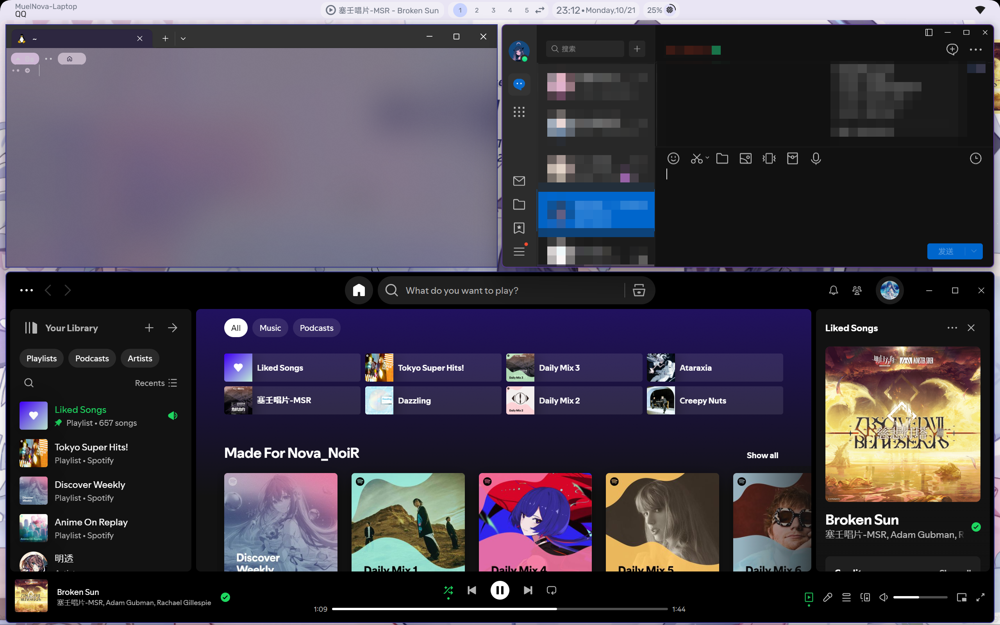

# RhineBar

Yet Another [zebar](https://github.com/glzr-io/zebar) taskbar, with [GlazeWM](https://github.com/glzr-io/glazewm) supported, inspired by [end-4](https://end-4.github.io/dots-hyprland-wiki/en/general/showcase/)

## Showcase



## Download

### dev

from `artifacts` in [actions](actions/workflows/build.yml)

### latest

from [release](releases/latest)

## Installation

### From source

Any package manager (e.g. yarn)

```bash
yarn
yarn build

copy build ~/.glzr/zebar/rhinebar -r
```

Enable it from zebar

## Config

> Not yet implemented xD

## My Config

See [win_dotfiles](https://github.com/MuelNova/win_dotfiles)
